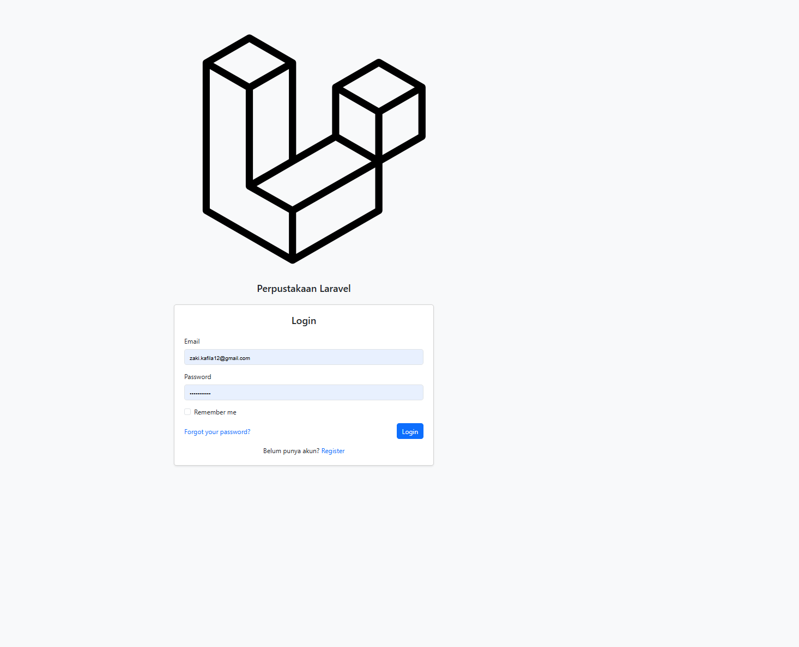
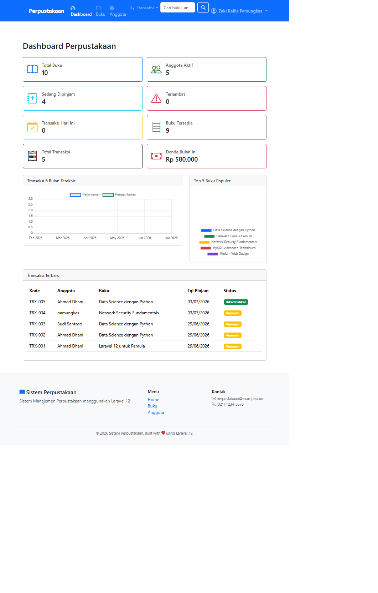
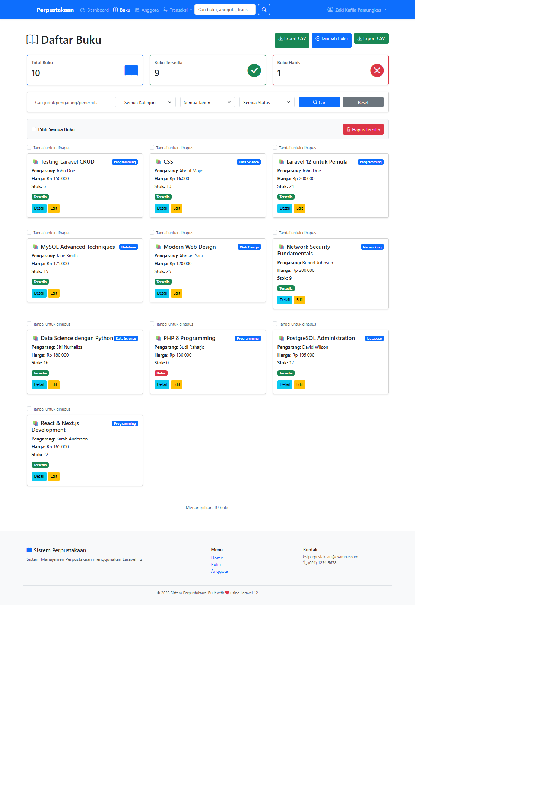
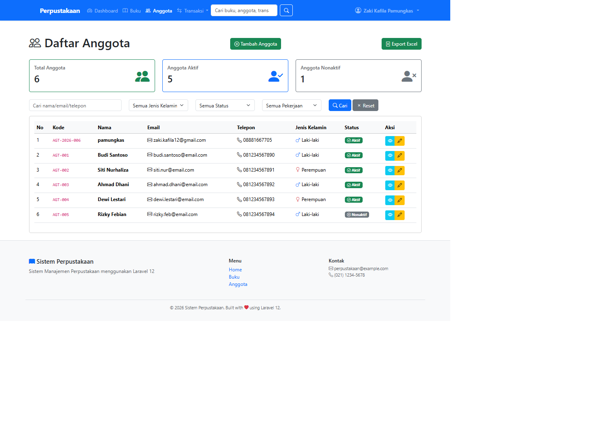
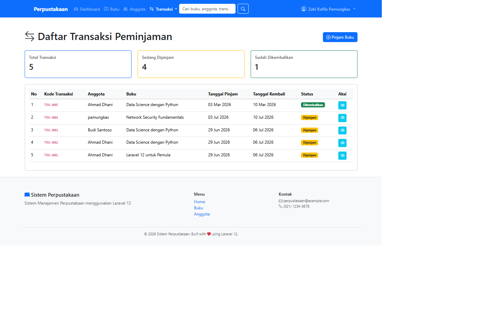
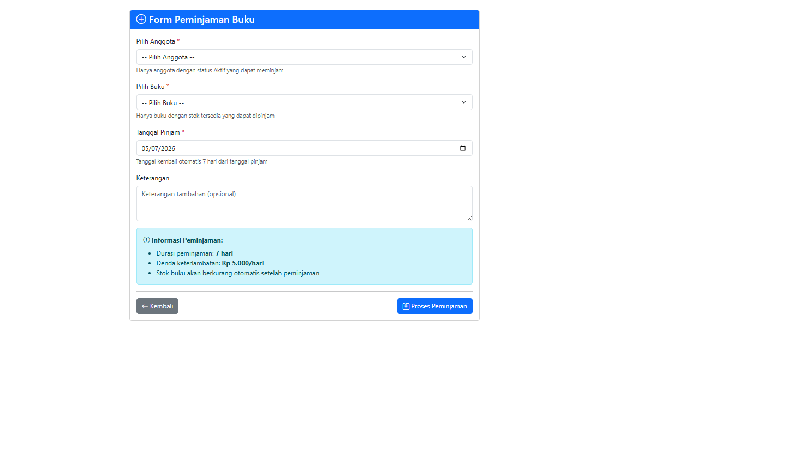
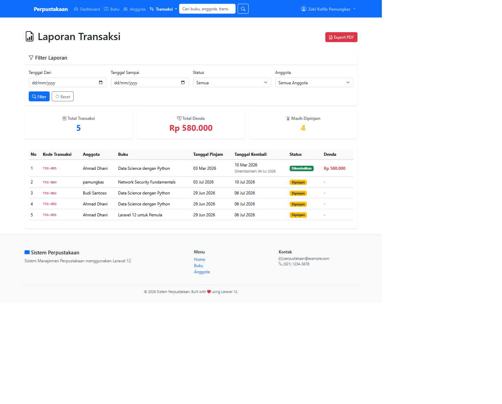
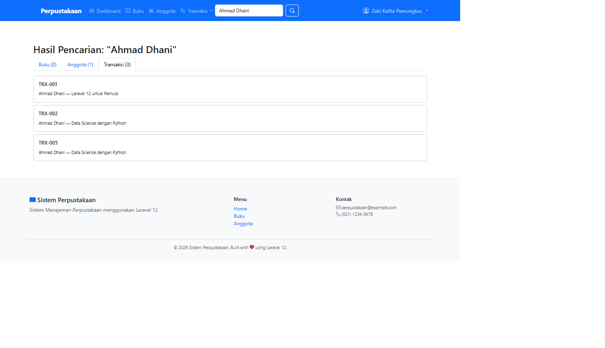
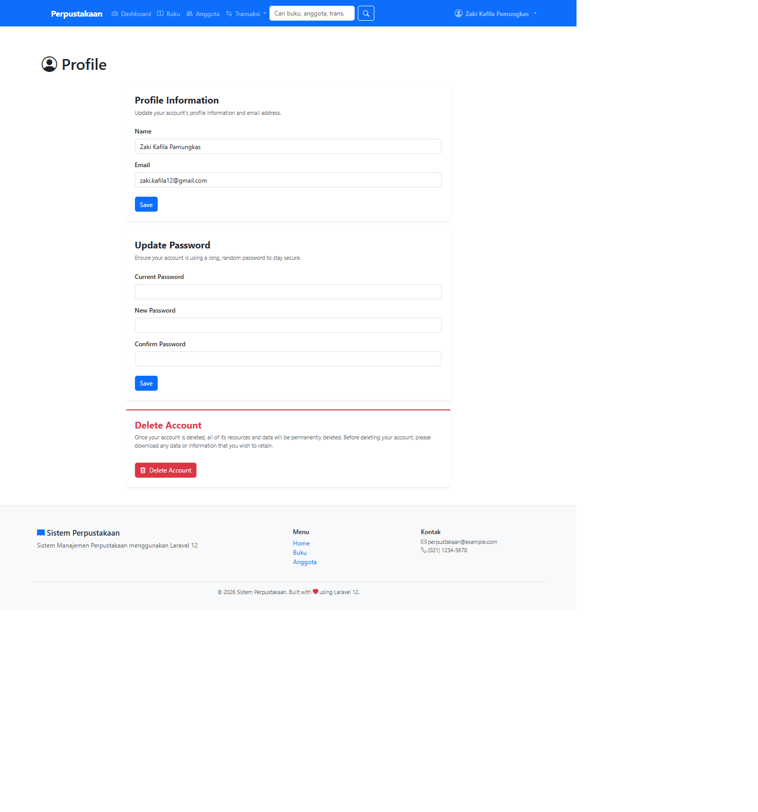

# 📚 Sistem Perpustakaan Laravel

Aplikasi manajemen perpustakaan berbasis Laravel untuk mengelola buku,
anggota, transaksi peminjaman, dan laporan.


## 📖 Deskripsi

Sistem ini dibuat untuk membantu pengelolaan perpustakaan secara digital
mulai dari pendataan buku hingga pengelolaan transaksi peminjaman dan
pengembalian buku.

## ✨ Fitur Utama

- 📚 Manajemen Buku
- 👥 Manajemen Anggota
- 🔄 Peminjaman Buku
- ↩️ Pengembalian Buku
- 💰 Perhitungan Denda Otomatis
- 📊 Dashboard Statistik
- 📄 Laporan PDF
- 🔍 Pencarian Global

## 🖼️ Screenshot

### 🔐 Login


### 📊 Dashboard


### 📚 Data Buku


### 👥 Data Anggota


### 🔄 Data Transaksi


### ➕ Form Peminjaman Buku


### 📄 Laporan Transaksi


### 🔍 Pencarian Data


### 👤 Profil Pengguna


## ⚙️ Instalasi

Clone repository:

```bash
git clone https://github.com/username/perpustakaan.git
```

Masuk ke folder project:

```bash
cd perpustakaan
```

Install dependency:

```bash
composer install
npm install
```

Copy file environment:

```bash
cp .env.example .env
```

Generate key:

```bash
php artisan key:generate
```

Migrasi database:

```bash
php artisan migrate
```

Jalankan server:

```bash
php artisan serve
```

## 🗄️ Database

| Tabel | Fungsi |
|------|--------|
| buku | Menyimpan data buku |
| anggota | Menyimpan data anggota |
| transaksi | Menyimpan transaksi peminjaman |
| users | Menyimpan data pengguna |

## 📂 Struktur Project

```text
app/
├── Models
├── Http
│   ├── Controllers
│   └── Requests
resources/
├── views
│   ├── buku
│   ├── anggota
│   ├── transaksi
│   └── layouts
routes/
└── web.php
```

## 🛠️ Teknologi

- Laravel 13
- PHP 8.3
- Bootstrap 5
- MySQL
- SweetAlert2
- Chart.js

  ## 👨‍💻 Author

**Zaki Kafila Pamungkas**

- GitHub: https://github.com/11pamungkas
- Email: zaki.kafila24020@mhs.uingusdur.ac.id
